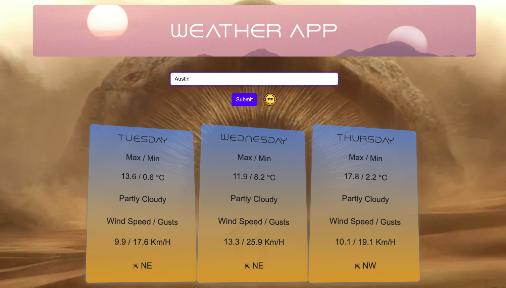

# Weather-app-Project-1
project 1 user submitted weather display app 

* As a user, I want to see a user submitted based web application displaying accurate weather using the submitted photos and images.

## Acceptance Criteria

* It's done when the web application pulls real time data for cities across the world

* Be deployed to GitHub Pages.

* Be interactive (i.e., accept and respond to user input).

* Use a CSS framework (see suggestions).

* Include at least one modal instead of native browser alert, confirm, or prompt functionality. Look into the CSS framework's documentation for more information!

* Use client-side storage to store persistent data.

* Be responsive.

* Have a polished UI.

* Have a clean repository that meets quality coding standards (file structure, naming conventions, follows best practices for class/id naming conventions, indentation, quality comments, etc.).

* Have a quality README (with unique name, description, technologies used, screenshot, and link to deployed application).

## Assets

* technologies used: HTML, CSS, JS, Bootstrap, Web APIs

## GitHub Deployment
* ()

## Link Refrences 

* [Google](https://www.google.com), [Youtube](https://www.youtube.com), [W3schools](https://www.w3schools.com), [Open-Meteo](https://open-meteo.com), [Freepik](https://www.freepik.com/search?format=search&iconType=standard&last_filter=query&last_value=freezing+drizzle&query=freezing+drizzle&type=icon);
